 

### About Me

I'm a passionate developer and tech enthusiast currently focused on building clean, efficient software and diving deep into algorithms and data structures. I love solving complex puzzles — whether that's optimizing code, structuring data, or digging into low-level engineering.

-  **Currently working on:** Sleek portfolio layouts and hobby electronics
-  **Learning & Exploring:** Stochastic modeling, advanced embedded systems, and interactive UI design
-  **Fun Fact:** When I'm not writing code, you can probably find me analyzing F1 telemetry data or keeping track of the latest EV tech

 

###  Tech Stack & Tools

**Languages**

**Frameworks & Libraries**

**Tools & Platforms**

 

###  GitHub Stats

  
  

  

 

###  Featured Projects

<table>
<tr>
<td width="50%" valign="top">

** [Portfolio Website](https://github.com/Simplicity005/Simplicity005.github.io)**

A sleek, responsive developer portfolio featuring a modern, card-based "bento box" layout. Built with CSS Flexbox/Grid and optimized for clean navigation.

`CSS` `Flexbox` `Grid`

</td>
<td width="50%" valign="top">

** [Embedded Systems / IoT Projects](https://github.com/Simplicity005/iisc-final-project-automated-car)**

Hobby electronics implementations using ESP32 and Arduino, focusing on hardware-software interfacing, sensor integration, and efficient power management.

`ESP32` `Arduino` `C++`

</td>
</tr>
</table>

 

### 🤝 Connect with me

